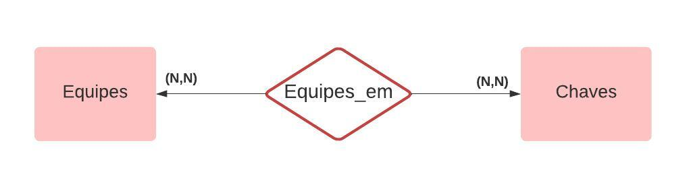

# Sistema de Gestão de Competição de Voleibol

Este projeto é um sistema de gestão de competições de voleibol desenvolvido com Flask. O sistema permite o gerenciamento de equipes e chaves, oferecendo uma interface para adicionar e editar essas entidades.

## Funcionalidades

- **Gerenciamento de Equipes**: Adicionar, editar e visualizar equipes.
- **Gerenciamento de Chaves**: Adicionar e remover equipes de chaves, visualizando as chaves e suas respectivas equipes.

## Estrutura do Projeto

- **app.py**: Contém a lógica do Flask e as rotas da aplicação.
- **db.py**: Responsável pela conexão com o banco de dados e pelas operações CRUD.
- **Templates**: Arquivos HTML para a interface do usuário.
- **Static**: Arquivos estáticos como CSS e imagens.

## Divisão dos Arquivos

- ┏ **Static** -- Armazenando arquivos estáticos.
  - ┣  - `fluxograma.jpeg` -- Imagem para melhor visualização de como funciona o fluxo de dados.
  - ┗  - `styles.css` -- Folha de estilos para deixar o uso mais agradável.

- ┏ **Template** -- Pasta utilizada para guardar os templates.
  - ┣  - `chaves.html` -- Template para listar e gerenciar chaves.
  - ┣  - `editar_chave.html` -- Formulário para editar as informações de uma chave existente.
  - ┣  - `equipes.html` -- Template para listar e gerenciar equipes.
  - ┣  - `equipes_chave.html` -- Template para gerenciar equipes associadas a uma chave.
  - ┣  - `form_chave.html` -- Formulário para criar uma nova chave.
  - ┗  - `form_equipe.html` -- Formulário para criar ou editar equipes.

- ┏ **README.md** -- Documento que contém informações sobre o projeto, como instalação e uso.

- ┏ **app.py** -- Arquivo principal da aplicação Flask, contendo as rotas e a lógica da aplicação.

- ┗ **db.py** -- Módulo que gerencia a interação com o banco de dados, contendo funções para acessar e manipular os dados.

## Fluxograma

O fluxograma abaixo ilustra a arquitetura e o fluxo de dados do sistema:

